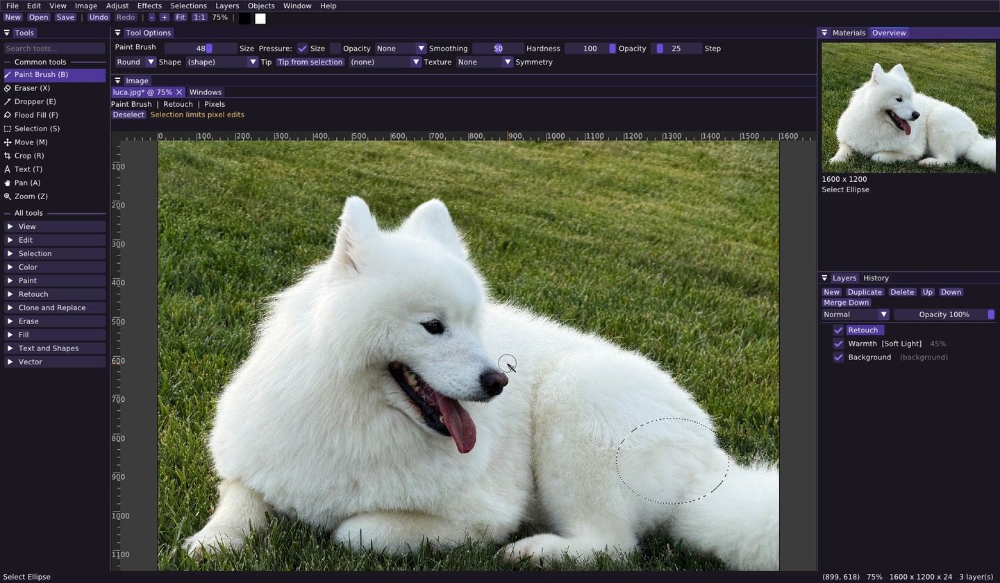

# Firn

**A fast, native image editor with layers, vectors and a scriptable core.**

[](https://github.com/Schneewolf-Labs/Firn/actions/workflows/build.yml)
[](https://github.com/Schneewolf-Labs/Firn/releases)
[](LICENSE)

Firn is a desktop raster editor for Linux, Windows and macOS. It brings back
the workflow of the classic 2004 paint program it grew out of, rebuilt from
scratch in modern C++ with none of the weight: it starts instantly, stays
responsive on large images, and every single thing it can do has a name you
can call from a script.



## Download

Packages for every release are on the
[Releases](https://github.com/Schneewolf-Labs/Firn/releases) page.

| Platform | File | Notes |
| --- | --- | --- |
| Linux | `Firn-<version>-x86_64.AppImage` | make it executable and run it, SDL2 is bundled |
| Linux | `Firn-<version>-Linux-x86_64.tar.gz` | uses the system SDL2, run `bin/firn` |
| Windows | `Firn-<version>-Windows-AMD64.zip` | `firn.exe` and friends in `bin/` |
| macOS | `Firn-<version>-Darwin-arm64.tar.gz` | needs `brew install sdl2` |

`SHA256SUMS.txt` lists the checksums. To build it yourself, see
[docs/BUILDING.md](docs/BUILDING.md).

## What it does

- **Layers that behave.** Raster, vector, adjustment and filter layers,
  grouped to any depth, each with a paintable mask, blend mode, opacity and
  layer styles. Every edit is one undo step, and the History palette shows
  the whole trail.
- **A full set of tools.** Brushes with custom tips, textures and real pen
  pressure. Clone, heal, smudge, dodge and burn, red-eye, scratch removal.
  Selections that every tool and command honors, and content-aware fill for
  removing things outright.
- **Vectors that stay editable.** Shapes, lines, paths and text remain
  objects you can reshape, restyle and retype long after you drew them.
- **Photographs taken seriously.** 16 bits per channel through the adjustment
  pipeline, embedded ICC profiles honored and preserved, curves and levels
  and channel mixing, six resampling filters including an edge-directed one
  for enlargements.
- **Effects.** Blurs, sharpening, noise, edge and art effects, distortions,
  lighting and textures, each with a live preview.
- **Metadata you control.** Exif tags and text notes are read, kept through
  every edit, and written back. Edit any of them, or strip the GPS and serial
  numbers before the picture leaves your machine.
- **Printing.** Page setup, fit or scale at a chosen DPI, straight to the
  printer or out as a PDF.

The full tour is in [docs/TOOLS.md](docs/TOOLS.md).

## Scriptable to the last menu item

Everything the interface can do is also a named action with typed parameters.
The same registry drives the menus, the command line and the socket, so there
is no second-class automation path.

```sh
firn-cli --launch photo.jpg state
firn-cli do image.resize '{"width":1600,"filter":"lanczos"}'
firn-cli do select.ellipse '{"x0":980,"y0":560,"x1":1200,"y1":740,"feather":4}'
firn-cli do edit.content_aware_fill '{}'
firn-cli do file.save_as '{"path":"out.png"}'
```

It draws, too. `draw.rectangle`, `draw.ellipse`, `draw.polygon` and
`draw.path` place shapes as editable vector objects or rasterize them,
`draw.stroke` paints a brush stroke, and `app.batch` applies a whole list
atomically as one undo step that rolls back if any part of it is refused.
`samples/api-cat.json` draws a complete editable picture in one call.

`firn-cli describe` prints the entire API as JSON Schema, which is enough for
a language model to operate Firn without being taught anything else.
[docs/API-reference.md](docs/API-reference.md) is the generated manual, and
[docs/API.md](docs/API.md) covers the command line, the socket and running
the original program's `.PspScript` files.

## File formats

Projects are saved as **OpenRaster** (`.ora`), the open layered format that
GIMP, Krita and MyPaint also read, and nothing is lost in the trip. Layers,
groups, masks, vector objects, adjustment and filter layers, layer styles,
16-bit layers, color profiles, saved selections and metadata all come back
exactly as they were, down to the active layer and the live selection. A
test walks every field of the document model to keep it that way. Firn-only
details ride in extension attributes other editors ignore.

Firn also reads and writes the original program's native container
(`.PspImage`, and the `.PspTube` and `.PspFrame` files that share it) with its
layers, vector shapes, gradients and groups intact, so files move in both
directions. It opens PNG, JPEG, BMP, TGA, GIF and PNM, and flattens to PNG,
JPEG, BMP and TGA. `firn-convert` does all of this from the command line, and
[docs/FORMAT.md](docs/FORMAT.md) documents the container.

## Project

Firn is a [Schneewolf Labs](https://github.com/Schneewolf-Labs) project under
the Apache License 2.0. It is an independent reimplementation, written from
studying the original program's behavior and published formats, and is not
affiliated with its publishers.

- [docs/ROADMAP.md](docs/ROADMAP.md) — what is planned, ranked
- [docs/BUILDING.md](docs/BUILDING.md) — build, test and install from source
- [CHANGELOG.md](CHANGELOG.md) — what changed in each release

`samples/luca.jpg` is included for trying things out and is used in the
screenshot above.

It bundles Dear ImGui (MIT) and the stb libraries (public domain / MIT), and
links SDL2 (zlib).
